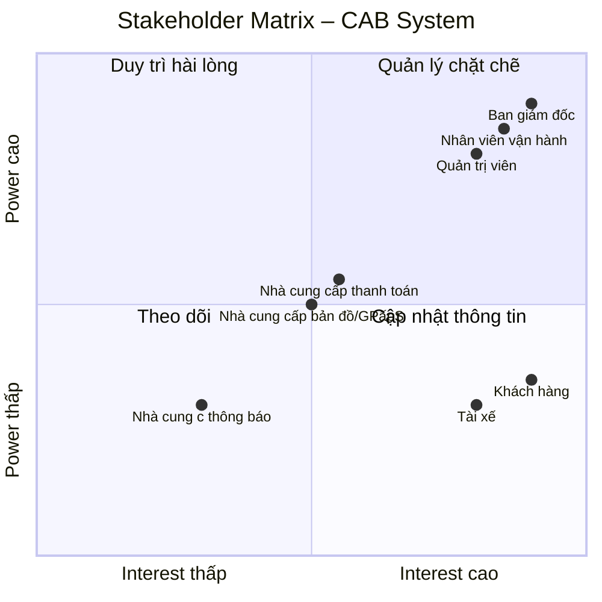
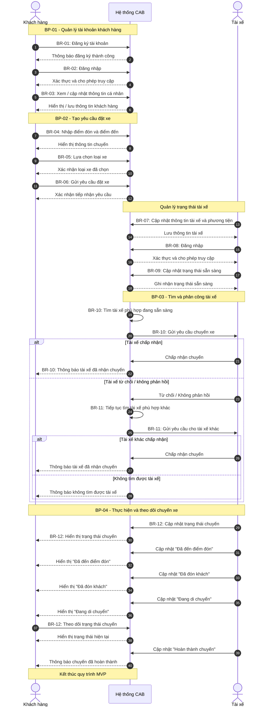
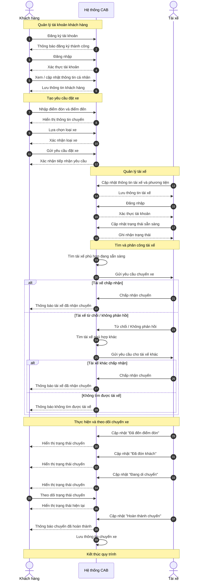
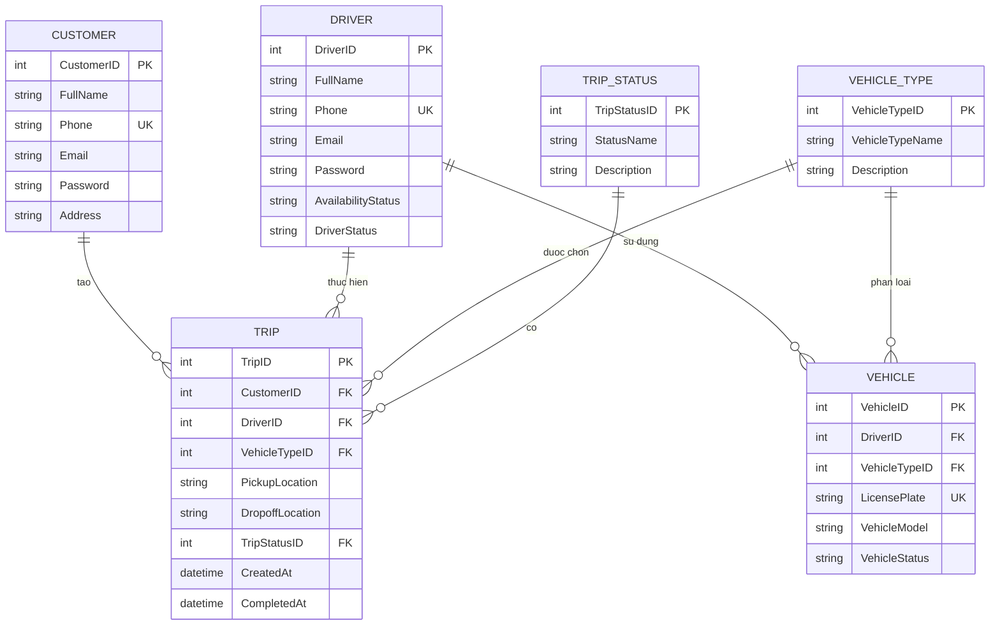
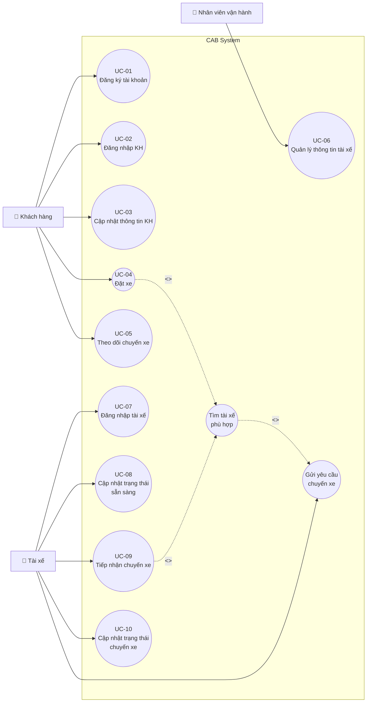

Stakeholder chính:

Ban giám đốc
Khách hàng
Tài xế
Nhân viên vận hành
Quản trị viên

# Stakeholder – CAB System

| Tên stakeholder | Vai trò stakeholder chính |
|---|---|
| **Ban giám đốc Công ty ABC** | Định hướng dự án, xác định mục tiêu và yêu cầu kinh doanh; theo dõi các báo cáo về số lượng chuyến, doanh thu, tỷ lệ hoàn thành, tỷ lệ hủy và hiệu quả hoạt động của tài xế. |
| **Khách hàng** | Đăng ký tài khoản, đặt xe, theo dõi chuyến đi, thanh toán, xem lịch sử chuyến và đánh giá tài xế. |
| **Tài xế** | Quản lý hồ sơ, phương tiện và trạng thái hoạt động; nhận và thực hiện chuyến, cập nhật trạng thái và vị trí. |
| **Nhân viên vận hành** | Quản lý khách hàng, tài xế, phương tiện và chuyến đi; theo dõi các chuyến đang diễn ra và hỗ trợ xử lý các trường hợp chuyến bị lỗi. |
| **Quản trị viên hệ thống** | Quản lý tài khoản, phân quyền và kiểm soát các thao tác quản trị nhạy cảm trên hệ thống. |
| **Nhà cung cấp dịch vụ thanh toán** | Xử lý các giao dịch thanh toán điện tử cho khách hàng thông qua hệ thống CAB. |
| **Nhà cung cấp dịch vụ bản đồ/GPS** | Cung cấp thông tin vị trí, khoảng cách và hỗ trợ tìm tài xế gần khách hàng, dự kiến thời gian tài xế đến. |
| **Nhà cung cấp dịch vụ thông báo** | Cung cấp các kênh gửi thông báo đến khách hàng và tài xế về trạng thái chuyến đi, thanh toán và các thay đổi liên quan. |


# Stakeholder Matrix – CAB System

| Stakeholder | Power | Interest | Chiến lược quản lý |
|---|---|---|---|
| **Ban giám đốc Công ty ABC** | Cao | Cao | Quản lý chặt chẽ; thường xuyên trao đổi, báo cáo tiến độ và xác nhận các quyết định quan trọng. |
| **Khách hàng** | Thấp | Cao | Thường xuyên cập nhật và thu thập phản hồi để đảm bảo hệ thống đáp ứng nhu cầu sử dụng. |
| **Tài xế** | Thấp | Cao | Thường xuyên trao đổi và thu thập phản hồi về quy trình nhận, thực hiện và hoàn thành chuyến. |
| **Nhân viên vận hành** | Cao | Cao | Quản lý chặt chẽ; tham gia phân tích nghiệp vụ, kiểm thử và xác nhận các quy trình vận hành. |
| **Quản trị viên hệ thống** | Cao | Cao | Quản lý chặt chẽ; tham gia xác định yêu cầu về tài khoản, phân quyền và bảo mật. |
| **Nhà cung cấp dịch vụ thanh toán** | Trung bình | Trung bình | Duy trì quan hệ và phối hợp khi tích hợp, xử lý giao dịch hoặc sự cố thanh toán. |
| **Nhà cung cấp dịch vụ bản đồ/GPS** | Trung bình | Trung bình | Duy trì quan hệ; phối hợp về dữ liệu vị trí, khoảng cách và dịch vụ bản đồ. |
| **Nhà cung cấp dịch vụ thông báo** | Trung bình | Thấp | Theo dõi và cung cấp thông tin cần thiết khi tích hợp hoặc xử lý sự cố thông báo. |


## Stakeholder Matrix – CAB System

### Power – Interest Matrix


# Business Rules – CAB System MVP

## 1. Quy tắc tài khoản và phân quyền

| Mã | Business Rule |
|---|---|
| **BR-01** | Khách hàng và tài xế phải được xác thực trước khi sử dụng các chức năng yêu cầu tài khoản. |
| **BR-02** | Chỉ người dùng có quyền phù hợp mới được thực hiện các thao tác quản trị. |
| **BR-03** | Thông tin cá nhân của khách hàng và tài xế phải được bảo vệ. |

## 2. Quy tắc đặt xe

| Mã | Business Rule |
|---|---|
| **BR-04** | Một yêu cầu đặt xe phải có điểm đón, điểm đến và loại xe. |
| **BR-05** | Sau khi khách hàng gửi yêu cầu, hệ thống phải chuyển yêu cầu sang trạng thái tìm tài xế. |
| **BR-06** | Khách hàng phải được thông báo về trạng thái xử lý yêu cầu đặt xe. |

## 3. Quy tắc tìm và phân công tài xế

| Mã | Business Rule |
|---|---|
| **BR-07** | Hệ thống chỉ xem xét các tài xế đang ở trạng thái sẵn sàng nhận chuyến. |
| **BR-08** | Tài xế được lựa chọn phải phù hợp với loại xe mà khách hàng yêu cầu. |
| **BR-09** | Hệ thống phải ưu tiên tài xế phù hợp và gần điểm đón của khách hàng. |
| **BR-10** | Nếu tài xế được đề xuất không phản hồi hoặc từ chối chuyến, hệ thống phải tiếp tục tìm tài xế khác. |
| **BR-11** | Nếu không tìm được tài xế phù hợp, hệ thống phải thông báo cho khách hàng. |
| **BR-12** | Khi tài xế chấp nhận chuyến, hệ thống phải ghi nhận tài xế được phân công cho chuyến đó. |

## 4. Quy tắc thực hiện chuyến

| Mã | Business Rule |
|---|---|
| **BR-13** | Tài xế phải cập nhật trạng thái chuyến trong quá trình thực hiện. |
| **BR-14** | Các trạng thái chính của chuyến gồm: tìm tài xế, đã phân công tài xế, tài xế đến điểm đón, đã đón khách, đang di chuyển và hoàn thành. |
| **BR-15** | Khi chuyến hoàn thành, hệ thống phải ghi nhận thông tin chuyến để phục vụ tính cước, thanh toán và lưu lịch sử. |
| **BR-16** | Hệ thống phải lưu thông tin vị trí của tài xế để hỗ trợ tìm tài xế và dự kiến thời gian đến. |

## 5. Quy tắc tính cước và thanh toán

| Mã | Business Rule |
|---|---|
| **BR-17** | Sau khi chuyến hoàn thành, hệ thống phải xác định số tiền khách hàng phải trả dựa trên loại dịch vụ và thông tin chuyến đi. |
| **BR-18** | Khách hàng được phép thanh toán bằng tiền mặt hoặc phương thức thanh toán điện tử được hệ thống hỗ trợ. |
| **BR-19** | Thông tin nhạy cảm của thẻ hoặc tài khoản thanh toán không được lưu trực tiếp trong hệ thống CAB. |
| **BR-20** | Thanh toán điện tử phải được xử lý thông qua nhà cung cấp dịch vụ thanh toán bên ngoài. |
| **BR-21** | Khi thanh toán điện tử thất bại, hệ thống phải thông báo cho khách hàng và cho phép xử lý lại theo chính sách của doanh nghiệp. |

## 6. Quy tắc thông báo

| Mã | Business Rule |
|---|---|
| **BR-22** | Khách hàng phải được thông báo khi yêu cầu đặt xe được tiếp nhận. |
| **BR-23** | Khách hàng phải được thông báo khi tài xế nhận chuyến. |
| **BR-24** | Khách hàng phải được thông báo khi tài xế đến điểm đón. |
| **BR-25** | Khách hàng phải được thông báo khi chuyến xe hoàn thành và khi thanh toán có kết quả. |
| **BR-26** | Tài xế phải được thông báo khi có chuyến mới hoặc có thay đổi liên quan đến chuyến đang thực hiện. |

## 7. Quy tắc vận hành

| Mã | Business Rule |
|---|---|
| **BR-27** | Nhân viên vận hành được phép theo dõi các chuyến đang diễn ra và trạng thái tài xế theo quyền được cấp. |
| **BR-28** | Nhân viên vận hành được phép hỗ trợ xử lý các trường hợp chuyến bị lỗi theo chính sách của doanh nghiệp. |
| **BR-29** | Các thao tác quản trị quan trọng phải được lưu vết để phục vụ kiểm tra và xử lý sự cố. |
---

# Business Rules cần xác nhận

Các quy tắc dưới đây chưa được xác định cụ thể trong yêu cầu hiện tại. Cần trao đổi với khách hàng hoặc Ban giám đốc trước khi triển khai chính thức.

| Mã | Nội dung cần xác nhận |
|---|---|
| **BR-Q01** | Bán kính tối đa để hệ thống tìm kiếm tài xế là bao nhiêu? |
| **BR-Q02** | Tài xế có bao nhiêu thời gian để phản hồi yêu cầu chuyến? |
| **BR-Q03** | Sau khi tài xế từ chối hoặc không phản hồi, hệ thống chuyển sang tài xế tiếp theo sau bao lâu? |
| **BR-Q04** | Ngoài khoảng cách, hệ thống có tiêu chí nào khác để ưu tiên tài xế không? |
| **BR-Q05** | Công thức tính cước chuyến xe cụ thể là gì? |
| **BR-Q06** | Có áp dụng phụ phí theo thời điểm, quãng đường, loại xe hoặc điều kiện khác không? |
| **BR-Q07** | Khách hàng có được phép hủy chuyến không và có phát sinh phí hủy không? |
| **BR-Q08** | Nếu tài xế hủy chuyến sau khi đã nhận, hệ thống có tự động tìm tài xế khác không? |
| **BR-Q09** | Khi thanh toán điện tử thất bại, khách hàng được phép thanh toán lại bao nhiêu lần? |
| **BR-Q10** | Khi mất kết nối mạng hoặc GPS, hệ thống xử lý trạng thái chuyến và vị trí tài xế như thế nào? |

---

# Tổng kết Business Rules

| Loại | Số lượng | Phạm vi |
|---|---:|---|
| Business Rules chính thức | **29** | Sử dụng cho MVP |
| Business Rules cần xác nhận | **10** | Cần thống nhất với khách hàng |
| **Tổng cộng** | **39** | Bao gồm cả nội dung cần xác nhận |

> **Lưu ý:** BR-Q01 đến BR-Q10 chưa được xem là Business Rule chính thức của hệ thống. Sau khi khách hàng xác nhận, các nội dung này mới được chuẩn hóa thành Business Rule chính thức và đánh số lại nếu cần.
>
BUOC 4
# Business Rules – CAB System MVP

## 1. Phạm vi phát triển MVP

MVP của CAB System tập trung vào hai module chính:

* **Quản lý khách hàng**
* **Quản lý tài xế**

Mục tiêu của MVP là xây dựng được luồng đặt xe cơ bản và đảm bảo hệ thống có thể vận hành một chuyến xe từ khi khách hàng gửi yêu cầu đến khi chuyến xe hoàn thành.

Trong giai đoạn MVP, hệ thống **chưa yêu cầu thuật toán lựa chọn tài xế tốt nhất**. Hệ thống chỉ cần tìm một tài xế **phù hợp với loại xe và đang sẵn sàng nhận chuyến**.

---

# 2. Business Rules áp dụng cho MVP

## 2.1. Quản lý khách hàng

| Mã        | Business Rule                                                                              |
| --------- | ------------------------------------------------------------------------------------------ |
| **BR-01** | Khách hàng và tài xế phải được xác thực trước khi sử dụng các chức năng yêu cầu tài khoản. |
| **BR-03** | Thông tin cá nhân của khách hàng và tài xế phải được bảo vệ.                               |
| **BR-04** | Một yêu cầu đặt xe phải có điểm đón, điểm đến và loại xe.                                  |
| **BR-05** | Sau khi khách hàng gửi yêu cầu, hệ thống phải chuyển yêu cầu sang trạng thái tìm tài xế.   |
| **BR-06** | Khách hàng phải được thông báo về trạng thái xử lý yêu cầu đặt xe.                         |
| **BR-15** | Khi chuyến hoàn thành, hệ thống phải ghi nhận thông tin chuyến để phục vụ lưu lịch sử.     |
| **BR-22** | Khách hàng phải được thông báo khi yêu cầu đặt xe được tiếp nhận.                          |
| **BR-23** | Khách hàng phải được thông báo khi tài xế nhận chuyến.                                     |
| **BR-24** | Khách hàng phải được thông báo khi tài xế đến điểm đón.                                    |
| **BR-25** | Khách hàng phải được thông báo khi chuyến xe hoàn thành.                                   |

---

## 2.2. Quản lý tài xế

| Mã        | Business Rule                                                                                                                          |
| --------- | -------------------------------------------------------------------------------------------------------------------------------------- |
| **BR-01** | Khách hàng và tài xế phải được xác thực trước khi sử dụng các chức năng yêu cầu tài khoản.                                             |
| **BR-03** | Thông tin cá nhân của khách hàng và tài xế phải được bảo vệ.                                                                           |
| **BR-07** | Hệ thống chỉ xem xét các tài xế đang ở trạng thái sẵn sàng nhận chuyến.                                                                |
| **BR-08** | Tài xế được lựa chọn phải phù hợp với loại xe mà khách hàng yêu cầu.                                                                   |
| **BR-10** | Nếu tài xế được đề xuất không phản hồi hoặc từ chối chuyến, hệ thống phải tiếp tục tìm tài xế khác.                                    |
| **BR-12** | Khi tài xế chấp nhận chuyến, hệ thống phải ghi nhận tài xế được phân công cho chuyến đó.                                               |
| **BR-13** | Tài xế phải cập nhật trạng thái chuyến trong quá trình thực hiện.                                                                      |
| **BR-14** | Các trạng thái chính của chuyến gồm: tìm tài xế, đã phân công tài xế, tài xế đến điểm đón, đã đón khách, đang di chuyển và hoàn thành. |
| **BR-16** | Hệ thống phải lưu thông tin vị trí của tài xế để hỗ trợ tìm tài xế và dự kiến thời gian đến.                                           |
| **BR-26** | Tài xế phải được thông báo khi có chuyến mới hoặc có thay đổi liên quan đến chuyến đang thực hiện.                                     |

---

# 3. Quy tắc tìm tài xế trong MVP

Để giới hạn phạm vi phát triển, chức năng tìm tài xế chỉ thực hiện ở mức cơ bản.

| Mã            | Business Rule                                                                                               |
| ------------- | ----------------------------------------------------------------------------------------------------------- |
| **BR-MVP-01** | Hệ thống chỉ tìm tài xế đang ở trạng thái sẵn sàng nhận chuyến.                                             |
| **BR-MVP-02** | Tài xế được chọn phải phù hợp với loại xe khách hàng yêu cầu.                                               |
| **BR-MVP-03** | Hệ thống chỉ cần tìm được một tài xế phù hợp để tiếp tục chuyến xe, không yêu cầu lựa chọn tài xế tốt nhất. |
| **BR-MVP-04** | Nếu tài xế từ chối hoặc không phản hồi, hệ thống có thể tiếp tục gửi yêu cầu đến tài xế phù hợp khác.       |
| **BR-MVP-05** | Nếu không tìm được tài xế, hệ thống phải thông báo cho khách hàng.                                          |

> **Lưu ý:** Các BR-MVP-01 đến BR-MVP-05 là cách cụ thể hóa các BR-07, BR-08, BR-10, BR-11 và phạm vi MVP. Không phát triển thuật toán xếp hạng hoặc tối ưu tài xế trong giai đoạn này.

---

# 4. Luồng nghiệp vụ tối thiểu của MVP

MVP phải đảm bảo được luồng nghiệp vụ sau:

```text
Khách hàng đăng nhập
        ↓
Nhập điểm đón + điểm đến + loại xe
        ↓
Gửi yêu cầu đặt xe
        ↓
Hệ thống tìm tài xế phù hợp
        ↓
Có tài xế?
   ┌────┴────┐
   │         │
  Có        Không
   │         │
   ↓         ↓
Tài xế     Thông báo
nhận chuyến không tìm thấy tài xế
   │
   ↓
Tài xế đến điểm đón
   ↓
Đã đón khách
   ↓
Đang di chuyển
   ↓
Hoàn thành chuyến
   ↓
Lưu lịch sử chuyến
```

---

# 5. Các Business Rules chưa triển khai trong MVP

Các quy tắc sau được giữ lại cho các giai đoạn tiếp theo:

| Mã        | Business Rule                                                                               | Giai đoạn |
| --------- | ------------------------------------------------------------------------------------------- | --------- |
| **BR-02** | Chỉ người dùng có quyền phù hợp mới được thực hiện các thao tác quản trị.                   | Sau MVP   |
| **BR-09** | Hệ thống phải ưu tiên tài xế phù hợp và gần điểm đón của khách hàng.                        | Sau MVP   |
| **BR-17** | Hệ thống xác định số tiền khách hàng phải trả dựa trên loại dịch vụ và thông tin chuyến đi. | Sau MVP   |
| **BR-18** | Thanh toán bằng tiền mặt hoặc phương thức thanh toán điện tử.                               | Sau MVP   |
| **BR-19** | Không lưu thông tin nhạy cảm của thẻ hoặc tài khoản thanh toán trực tiếp trên CAB.          | Sau MVP   |
| **BR-20** | Thanh toán điện tử thông qua nhà cung cấp bên ngoài.                                        | Sau MVP   |
| **BR-21** | Xử lý trường hợp thanh toán điện tử thất bại.                                               | Sau MVP   |
| **BR-27** | Nhân viên vận hành theo dõi chuyến đang diễn ra và trạng thái tài xế.                       | Sau MVP   |
| **BR-28** | Nhân viên vận hành hỗ trợ xử lý chuyến bị lỗi.                                              | Sau MVP   |
| **BR-29** | Lưu vết các thao tác quản trị quan trọng.                                                   | Sau MVP   |

---

# 6. Tổng kết phạm vi MVP

| Nội dung                     | Trạng thái          |
| ---------------------------- | ------------------- |
| Quản lý khách hàng           | **MVP**             |
| Quản lý tài xế               | **MVP**             |
| Đăng ký / đăng nhập          | **MVP**             |
| Quản lý thông tin khách hàng | **MVP**             |
| Quản lý thông tin tài xế     | **MVP**             |
| Đặt xe                       | **MVP**             |
| Tìm tài xế cơ bản            | **MVP**             |
| Tối ưu tài xế tốt nhất       | **Không thuộc MVP** |
| Phân công tài xế             | **MVP**             |
| Cập nhật trạng thái chuyến   | **MVP**             |
| Theo dõi chuyến              | **MVP**             |
| Thông báo cơ bản             | **MVP**             |
| Lịch sử chuyến               | **MVP**             |
| Tính cước nâng cao           | **Sau MVP**         |
| Thanh toán điện tử           | **Sau MVP**         |
| Báo cáo vận hành             | **Sau MVP**         |
| Phân tích hiệu suất tài xế   | **Sau MVP**         |

---

## Kết luận

**MVP không cần triển khai toàn bộ 29 Business Rules ban đầu.**

Phạm vi phát triển giai đoạn này chỉ tập trung vào:

> **Quản lý khách hàng + Quản lý tài xế + luồng đặt và thực hiện chuyến cơ bản.**

Trong đó chức năng tìm tài xế chỉ cần đáp ứng:

> **Có tài xế phù hợp → gửi yêu cầu → tài xế nhận → thực hiện chuyến.**

Chưa cần:

> **xếp hạng → tính điểm → tối ưu khoảng cách → chọn tài xế tốt nhất → thuật toán dispatch nâng cao.**

# Business Requirements – CAB System MVP

## 1. Phạm vi MVP

Trong giai đoạn MVP, CAB System tập trung phát triển hai module:

* **Quản lý khách hàng**
* **Quản lý tài xế**

Mục tiêu của MVP là xây dựng được quy trình đặt và thực hiện chuyến xe cơ bản.

Hệ thống chưa tập trung vào việc tìm kiếm và lựa chọn **tài xế tốt nhất**. Chỉ cần hệ thống tìm được một tài xế phù hợp và đang sẵn sàng nhận chuyến để hoàn thành quy trình đặt xe.

---

# 2. Business Requirements – Quản lý khách hàng

| Mã        | Business Requirement                                                                              |
| --------- | ------------------------------------------------------------------------------------------------- |
| **BR-01** | Hệ thống phải cho phép khách hàng đăng ký tài khoản.                                              |
| **BR-02** | Hệ thống phải cho phép khách hàng đăng nhập vào hệ thống.                                         |
| **BR-03** | Hệ thống phải cho phép khách hàng xem và cập nhật thông tin cá nhân.                              |
| **BR-04** | Hệ thống phải cho phép khách hàng nhập điểm đón khi đặt xe.                                       |
| **BR-05** | Hệ thống phải cho phép khách hàng nhập điểm đến khi đặt xe.                                       |
| **BR-06** | Hệ thống phải cho phép khách hàng lựa chọn loại xe khi đặt xe.                                    |
| **BR-07** | Hệ thống phải cho phép khách hàng gửi yêu cầu đặt xe sau khi cung cấp đầy đủ thông tin chuyến đi. |
| **BR-08** | Hệ thống phải cho phép khách hàng theo dõi trạng thái xử lý yêu cầu đặt xe.                       |
| **BR-09** | Hệ thống phải hiển thị thông tin tài xế được phân công cho khách hàng khi có tài xế nhận chuyến.  |
| **BR-10** | Hệ thống phải cho phép khách hàng theo dõi trạng thái chuyến xe.                                  |
| **BR-11** | Hệ thống phải cho phép khách hàng xem lịch sử các chuyến xe đã hoàn thành.                        |

---

# 3. Business Requirements – Quản lý tài xế

| Mã        | Business Requirement                                                                          |
| --------- | --------------------------------------------------------------------------------------------- |
| **BR-12** | Hệ thống phải cho phép tài xế đăng nhập vào hệ thống.                                         |
| **BR-13** | Hệ thống phải cho phép tài xế xem và cập nhật thông tin cá nhân.                              |
| **BR-14** | Hệ thống phải cho phép tài xế xem và cập nhật thông tin phương tiện.                          |
| **BR-15** | Hệ thống phải cho phép tài xế chuyển đổi trạng thái sẵn sàng hoặc không sẵn sàng nhận chuyến. |
| **BR-16** | Hệ thống phải gửi thông báo cho tài xế khi có yêu cầu chuyến xe phù hợp.                      |
| **BR-17** | Hệ thống phải cho phép tài xế chấp nhận hoặc từ chối yêu cầu chuyến xe.                       |
| **BR-18** | Hệ thống phải ghi nhận tài xế được phân công khi tài xế chấp nhận chuyến.                     |
| **BR-19** | Hệ thống phải cho phép tài xế cập nhật trạng thái chuyến xe trong quá trình thực hiện.        |
| **BR-20** | Hệ thống phải ghi nhận vị trí của tài xế trong quá trình phục vụ chuyến xe.                   |

---

# 4. Business Requirements – Đặt và phân công chuyến xe

Đây là các yêu cầu nghiệp vụ cần thiết để hai module **Quản lý khách hàng** và **Quản lý tài xế** có thể hoạt động cùng nhau.

| Mã        | Business Requirement                                                                            |
| --------- | ----------------------------------------------------------------------------------------------- |
| **BR-21** | Hệ thống phải tìm kiếm các tài xế đang sẵn sàng nhận chuyến.                                    |
| **BR-22** | Hệ thống phải chỉ gửi yêu cầu đến tài xế có loại xe phù hợp với loại xe khách hàng đã lựa chọn. |
| **BR-23** | Hệ thống phải phân công chuyến cho tài xế khi tài xế chấp nhận yêu cầu.                         |
| **BR-24** | Nếu tài xế từ chối yêu cầu, hệ thống phải tiếp tục tìm tài xế phù hợp khác.                     |
| **BR-25** | Nếu không có tài xế phù hợp, hệ thống phải thông báo cho khách hàng.                            |
| **BR-26** | Hệ thống phải quản lý trạng thái chuyến xe từ khi tìm tài xế đến khi chuyến hoàn thành.         |

---

# 5. Các trạng thái chuyến xe trong MVP

Trong MVP, hệ thống quản lý các trạng thái cơ bản:

```text
Tìm tài xế
     ↓
Đã phân công tài xế
     ↓
Tài xế đến điểm đón
     ↓
Đã đón khách
     ↓
Đang di chuyển
     ↓
Hoàn thành
```

Tài xế có trách nhiệm cập nhật trạng thái chuyến trong quá trình thực hiện.

---

# 6. Giới hạn MVP

## 6.1. Có trong MVP

| Chức năng                    | MVP   |
| ---------------------------- | ----- |
| Đăng ký khách hàng           | ✅     |
| Đăng nhập khách hàng         | ✅     |
| Quản lý thông tin khách hàng | ✅     |
| Nhập điểm đón                | ✅     |
| Nhập điểm đến                | ✅     |
| **Lựa chọn loại xe**         | **✅** |
| Gửi yêu cầu đặt xe           | ✅     |
| Tìm tài xế cơ bản            | ✅     |
| Tài xế online/offline        | ✅     |
| Tài xế nhận/từ chối chuyến   | ✅     |
| Phân công tài xế             | ✅     |
| Cập nhật trạng thái chuyến   | ✅     |
| Theo dõi trạng thái chuyến   | ✅     |
| Xem thông tin tài xế         | ✅     |
| Lưu lịch sử chuyến           | ✅     |

## 6.2. Chưa có trong MVP

| Chức năng                            | Trạng thái |
| ------------------------------------ | ---------- |
| Tìm tài xế tốt nhất                  | ❌          |
| Xếp hạng tài xế                      | ❌          |
| Tối ưu khoảng cách giữa nhiều tài xế | ❌          |
| Thuật toán điều phối nâng cao        | ❌          |
| Tính giá động                        | ❌          |
| Khuyến mãi/voucher                   | ❌          |
| Ví điện tử                           | ❌          |
| Chat khách hàng – tài xế             | ❌          |
| Đặt xe trước theo lịch               | ❌          |
| Nhiều điểm đón/trả                   | ❌          |
| Báo cáo phân tích tài xế nâng cao    | ❌          |

---

# 7. Mối quan hệ giữa Business Requirements và Module MVP

| Module                         | Business Requirements chính |
| ------------------------------ | --------------------------- |
| **Quản lý khách hàng**         | BR-01 → BR-11               |
| **Quản lý tài xế**             | BR-12 → BR-20               |
| **Đặt và phân công chuyến xe** | BR-21 → BR-26               |

### Luồng MVP tổng quát

```text
                 CAB SYSTEM MVP
                       │
          ┌────────────┴────────────┐
          │                         │
   Quản lý khách hàng        Quản lý tài xế
          │                         │
          │                         │
          └────── Đặt chuyến ───────┘
                       │
                       ↓
                Tìm tài xế cơ bản
                       │
              ┌────────┴────────┐
              │                 │
          Có tài xế         Không có
              │                 │
              ↓                 ↓
       Tài xế nhận chuyến    Thông báo KH
              │
              ↓
       Thực hiện chuyến
              │
              ↓
          Hoàn thành
              │
              ↓
        Lưu lịch sử chuyến
```

---

# Business – Business Requirement (BR) – CAB System MVP

| Business | Business Requirement (BR) |
|---|---|
| **B1. Doanh nghiệp cần quản lý thông tin khách hàng** | **BR-01:** Hệ thống phải cho phép khách hàng đăng ký tài khoản. |
| | **BR-02:** Hệ thống phải cho phép khách hàng đăng nhập. |
| | **BR-03:** Hệ thống phải cho phép khách hàng xem và cập nhật thông tin cá nhân. |
| **B2. Doanh nghiệp cần khách hàng có thể gửi yêu cầu đặt xe** | **BR-04:** Hệ thống phải cho phép khách hàng nhập điểm đón và điểm đến. |
| | **BR-05:** Hệ thống phải cho phép khách hàng lựa chọn loại xe phù hợp với nhu cầu. |
| | **BR-06:** Hệ thống phải cho phép khách hàng gửi yêu cầu đặt xe sau khi nhập đầy đủ thông tin. |
| **B3. Doanh nghiệp cần quản lý thông tin tài xế** | **BR-07:** Hệ thống phải cho phép quản lý thông tin tài xế. |
| | **BR-08:** Hệ thống phải cho phép quản lý thông tin phương tiện của tài xế. |
| | **BR-09:** Hệ thống phải cho phép tài xế đăng nhập và sử dụng hệ thống. |
| **B4. Doanh nghiệp cần biết tài xế nào đang có thể nhận chuyến** | **BR-10:** Hệ thống phải cho phép tài xế cập nhật trạng thái sẵn sàng hoặc không sẵn sàng nhận chuyến. |
| **B5. Doanh nghiệp cần phân công tài xế cho yêu cầu đặt xe** | **BR-11:** Hệ thống phải tìm tài xế đang sẵn sàng và phù hợp với loại xe khách hàng lựa chọn. |
| | **BR-12:** Hệ thống phải gửi yêu cầu chuyến xe đến tài xế phù hợp. |
| | **BR-13:** Hệ thống phải ghi nhận tài xế khi tài xế chấp nhận chuyến. |
| **B6. Doanh nghiệp cần chuyến xe được thực hiện trên hệ thống** | **BR-14:** Hệ thống phải cho phép tài xế cập nhật trạng thái chuyến xe. |
| | **BR-15:** Hệ thống phải quản lý trạng thái chuyến từ khi phân công tài xế đến khi hoàn thành. |
| **B7. Doanh nghiệp cần khách hàng biết tình trạng chuyến xe** | **BR-16:** Hệ thống phải cho phép khách hàng theo dõi trạng thái chuyến xe. |
| | **BR-17:** Hệ thống phải hiển thị thông tin tài xế được phân công cho khách hàng. |
| **B8. Doanh nghiệp cần xử lý trường hợp tài xế không nhận chuyến** | **BR-18:** Nếu tài xế từ chối hoặc không phản hồi, hệ thống phải tiếp tục tìm tài xế phù hợp khác. |
| | **BR-19:** Nếu không tìm được tài xế, hệ thống phải thông báo cho khách hàng. |
| **B9. Doanh nghiệp cần lưu lại thông tin chuyến xe** | **BR-20:** Hệ thống phải lưu thông tin các chuyến xe đã hoàn thành để phục vụ tra cứu lịch sử. |

BUSINESS
│
├── B1. Quản lý khách hàng
│   ├── BR-01 Đăng ký
│   ├── BR-02 Đăng nhập
│   └── BR-03 Cập nhật thông tin
│
├── B2. Đặt xe
│   ├── BR-04 Nhập điểm đón/điểm đến
│   ├── BR-05 Lựa chọn loại xe
│   └── BR-06 Gửi yêu cầu đặt xe
│
├── B3. Quản lý tài xế
│   ├── BR-07 Quản lý thông tin tài xế
│   ├── BR-08 Quản lý phương tiện
│   └── BR-09 Đăng nhập
│
├── B4. Trạng thái tài xế
│   └── BR-10 Sẵn sàng/Không sẵn sàng
│
├── B5. Phân công tài xế
│   ├── BR-11 Tìm tài xế phù hợp
│   ├── BR-12 Gửi yêu cầu chuyến
│   └── BR-13 Ghi nhận tài xế
│
├── B6. Thực hiện chuyến
│   ├── BR-14 Cập nhật trạng thái
│   └── BR-15 Quản lý trạng thái chuyến
│
├── B7. Theo dõi chuyến
│   ├── BR-16 Theo dõi trạng thái
│   └── BR-17 Xem thông tin tài xế
│
├── B8. Xử lý không có tài xế
│   ├── BR-18 Tìm tài xế khác
│   └── BR-19 Thông báo không có tài xế
│
└── B9. Lịch sử
    └── BR-20 Lưu lịch sử chuyến

**Khách hàng lựa chọn xe → gửi yêu cầu → hệ thống tìm tài xế phù hợp → tài xế nhận chuyến → thực hiện chuyến → hoàn thành.**

Trong giai đoạn này, hệ thống **không yêu cầu lựa chọn tài xế tốt nhất**, mà chỉ cần tìm được **một tài xế phù hợp và sẵn sàng** để đảm bảo quy trình đặt xe hoạt động.


# Business – Business Requirement (BR) – CAB System MVP

## 1. Quản lý khách hàng

| Business | Business Requirement (BR) |
|---|---|
| **B1. Doanh nghiệp cần quản lý tài khoản khách hàng** | **BR-01:** Hệ thống phải cho phép khách hàng đăng ký tài khoản. |
| | **BR-02:** Hệ thống phải cho phép khách hàng đăng nhập. |
| | **BR-03:** Hệ thống phải cho phép khách hàng xem và cập nhật thông tin cá nhân. |
| **B2. Doanh nghiệp cần khách hàng tạo yêu cầu đặt xe** | **BR-04:** Hệ thống phải cho phép khách hàng nhập điểm đón và điểm đến. |
| | **BR-05:** Hệ thống phải cho phép khách hàng lựa chọn loại xe. |
| | **BR-06:** Hệ thống phải cho phép khách hàng gửi yêu cầu đặt xe. |

## 2. Quản lý tài xế

| Business | Business Requirement (BR) |
|---|---|
| **B3. Doanh nghiệp cần quản lý thông tin tài xế** | **BR-07:** Hệ thống phải cho phép quản lý thông tin tài xế và phương tiện. |
| | **BR-08:** Hệ thống phải cho phép tài xế đăng nhập. |
| **B4. Doanh nghiệp cần biết tài xế có thể nhận chuyến** | **BR-09:** Hệ thống phải cho phép tài xế cập nhật trạng thái sẵn sàng hoặc không sẵn sàng nhận chuyến. |

## 3. Đặt xe và thực hiện chuyến

| Business | Business Requirement (BR) |
|---|---|
| **B5. Doanh nghiệp cần phân công tài xế cho yêu cầu đặt xe** | **BR-10:** Hệ thống phải tìm và gửi yêu cầu chuyến xe đến tài xế phù hợp đang sẵn sàng nhận chuyến. |
| | **BR-11:** Nếu tài xế từ chối hoặc không phản hồi, hệ thống phải tiếp tục tìm tài xế phù hợp khác. |
| **B6. Doanh nghiệp cần quản lý quá trình thực hiện chuyến xe** | **BR-12:** Hệ thống phải cho phép tài xế cập nhật trạng thái chuyến xe và cho phép khách hàng theo dõi trạng thái cho đến khi chuyến hoàn thành. |


Đúng. Nếu bạn muốn **mô hình hóa 12 BR bằng code để dán trực tiếp vào Markdown**, phù hợp nhất là dùng **Mermaid `sequenceDiagram`**.

Mình sẽ gộp cả **12 BR vào một quy trình nghiệp vụ xuyên suốt**, với 3 tác nhân chính: **Khách hàng – Hệ thống – Tài xế**.

Bạn copy nguyên khối dưới đây vào file `.md`:



### Tuy nhiên, có một điểm cần lưu ý

Nếu giảng viên yêu cầu đúng **“Business Process Modeling dựa trên Business Requirement”**, thì mình khuyên bạn **không ghi `BR-01`, `BR-02`... trực tiếp vào tên các message** khi nộp bản chính thức.

Nên dùng bản sạch như sau:



**Mình khuyên dùng bản thứ 2 để nộp**, vì nó thể hiện đúng bản chất **Business Process Modeling**: BR là **cơ sở để hình thành quy trình**, còn sơ đồ thể hiện **các hoạt động thực tế** trong quy trình.

Ngoài ra, với MVP của bạn, **12 BR này là đủ**; không cần đưa thanh toán, GPS nâng cao, báo cáo, notification đa kênh... vào sơ đồ này.

# FUNCTIONAL REQUIREMENTS – CAB SYSTEM MVP

## 1. Tổng quan

Functional Requirement (FR) mô tả các chức năng mà hệ thống CAB System phải cung cấp để đáp ứng các Business Requirement (BR).

Trong phạm vi MVP, hệ thống tập trung vào hai module:

- Quản lý khách hàng
- Quản lý tài xế

Các chức năng về thanh toán điện tử, tính cước nâng cao, báo cáo, GPS nâng cao và thông báo đa kênh chưa thuộc phạm vi MVP.

---

# 2. Functional Requirement

## 2.1. Module Quản lý khách hàng

| Mã FR | Business Requirement | Functional Requirement |
|---|---|---|
| **FR-01** | BR-01: Đăng ký tài khoản | Hệ thống phải cung cấp chức năng cho khách hàng nhập thông tin cần thiết và đăng ký tài khoản. |
| **FR-02** | BR-02: Đăng nhập | Hệ thống phải cung cấp chức năng cho khách hàng đăng nhập bằng thông tin tài khoản đã đăng ký. |
| **FR-03** | BR-03: Quản lý thông tin cá nhân | Hệ thống phải cho phép khách hàng xem và cập nhật thông tin cá nhân. |
| **FR-04** | BR-04: Nhập điểm đón và điểm đến | Hệ thống phải cho phép khách hàng nhập điểm đón và điểm đến khi tạo yêu cầu đặt xe. |
| **FR-05** | BR-05: Lựa chọn loại xe | Hệ thống phải hiển thị các loại xe được cung cấp và cho phép khách hàng lựa chọn loại xe khi đặt xe. |
| **FR-06** | BR-06: Gửi yêu cầu đặt xe | Hệ thống phải cho phép khách hàng kiểm tra thông tin đặt xe và gửi yêu cầu đặt xe. |
| **FR-07** | BR-12: Theo dõi chuyến xe | Hệ thống phải cho phép khách hàng xem thông tin tài xế và trạng thái hiện tại của chuyến xe. |

---

## 2.2. Module Quản lý tài xế

| Mã FR | Business Requirement | Functional Requirement |
|---|---|---|
| **FR-08** | BR-07: Quản lý thông tin tài xế | Hệ thống phải cho phép quản lý xem và cập nhật thông tin tài xế và phương tiện. |
| **FR-09** | BR-08: Tài xế đăng nhập | Hệ thống phải cung cấp chức năng cho tài xế đăng nhập bằng tài khoản được cấp. |
| **FR-10** | BR-09: Cập nhật trạng thái sẵn sàng | Hệ thống phải cho phép tài xế chuyển trạng thái giữa sẵn sàng và không sẵn sàng nhận chuyến. |
| **FR-11** | BR-10: Tìm và gửi yêu cầu chuyến | Hệ thống phải tìm tài xế phù hợp đang ở trạng thái sẵn sàng và gửi yêu cầu chuyến xe cho tài xế. |
| **FR-12** | BR-11: Tìm tài xế khác | Khi tài xế từ chối hoặc không phản hồi, hệ thống phải tiếp tục tìm và gửi yêu cầu cho tài xế phù hợp khác. |
| **FR-13** | BR-12: Cập nhật trạng thái chuyến | Hệ thống phải cho phép tài xế cập nhật trạng thái chuyến xe từ khi nhận chuyến đến khi hoàn thành. |

---

# 3. Chi tiết Functional Requirement

## FR-01 – Đăng ký tài khoản khách hàng

**Mô tả:**  
Hệ thống cho phép khách hàng tạo tài khoản để sử dụng dịch vụ.

**Chức năng:**
- Nhập thông tin đăng ký.
- Kiểm tra thông tin bắt buộc.
- Kiểm tra tài khoản đã tồn tại.
- Tạo tài khoản nếu thông tin hợp lệ.
- Thông báo kết quả đăng ký.

---

## FR-02 – Đăng nhập khách hàng

**Mô tả:**  
Hệ thống xác thực khách hàng trước khi sử dụng các chức năng yêu cầu tài khoản.

**Chức năng:**
- Nhập thông tin đăng nhập.
- Kiểm tra thông tin tài khoản.
- Cho phép truy cập nếu thông tin hợp lệ.
- Thông báo lỗi nếu thông tin không hợp lệ.

---

## FR-03 – Quản lý thông tin cá nhân

**Mô tả:**  
Khách hàng có thể xem và cập nhật thông tin cá nhân.

**Chức năng:**
- Xem thông tin cá nhân.
- Chỉnh sửa thông tin.
- Kiểm tra thông tin cập nhật.
- Lưu thông tin mới.

---

## FR-04 – Nhập thông tin chuyến xe

**Mô tả:**  
Khách hàng nhập thông tin cần thiết để tạo yêu cầu đặt xe.

**Chức năng:**
- Nhập điểm đón.
- Nhập điểm đến.
- Kiểm tra thông tin bắt buộc.
- Hiển thị thông tin chuyến đã nhập.

---

## FR-05 – Lựa chọn loại xe

**Mô tả:**  
Khách hàng lựa chọn loại xe muốn sử dụng.

**Chức năng:**
- Hiển thị danh sách loại xe.
- Cho phép khách hàng chọn một loại xe.
- Ghi nhận loại xe được lựa chọn.

---

## FR-06 – Gửi yêu cầu đặt xe

**Mô tả:**  
Khách hàng gửi yêu cầu đặt xe sau khi hoàn tất thông tin.

**Chức năng:**
- Hiển thị thông tin đặt xe.
- Kiểm tra thông tin đặt xe.
- Tạo yêu cầu đặt xe.
- Chuyển yêu cầu sang trạng thái đang tìm tài xế.

---

## FR-07 – Theo dõi chuyến xe

**Mô tả:**  
Khách hàng theo dõi thông tin và trạng thái chuyến sau khi gửi yêu cầu.

**Chức năng:**
- Hiển thị trạng thái chuyến.
- Hiển thị tài xế đã nhận chuyến.
- Hiển thị trạng thái thực hiện chuyến.
- Hiển thị trạng thái hoàn thành.

---

## FR-08 – Quản lý thông tin tài xế

**Mô tả:**  
Hệ thống cho phép quản lý thông tin tài xế và phương tiện.

**Chức năng:**
- Xem thông tin tài xế.
- Thêm thông tin tài xế.
- Cập nhật thông tin tài xế.
- Cập nhật thông tin phương tiện.

---

## FR-09 – Đăng nhập tài xế

**Mô tả:**  
Tài xế đăng nhập để sử dụng các chức năng dành cho tài xế.

**Chức năng:**
- Nhập thông tin đăng nhập.
- Xác thực tài khoản.
- Cho phép truy cập nếu hợp lệ.

---

## FR-10 – Cập nhật trạng thái sẵn sàng

**Mô tả:**  
Tài xế có thể thông báo cho hệ thống biết mình có thể nhận chuyến hay không.

**Chức năng:**
- Chuyển sang trạng thái "Sẵn sàng".
- Chuyển sang trạng thái "Không sẵn sàng".
- Lưu trạng thái hiện tại của tài xế.

---

## FR-11 – Tìm và gửi yêu cầu chuyến

**Mô tả:**  
Sau khi khách hàng gửi yêu cầu, hệ thống tìm tài xế phù hợp đang sẵn sàng.

**Chức năng:**
- Nhận yêu cầu đặt xe.
- Xác định loại xe khách hàng yêu cầu.
- Tìm tài xế có loại xe phù hợp.
- Kiểm tra trạng thái sẵn sàng.
- Gửi yêu cầu chuyến đến tài xế phù hợp.

---

## FR-12 – Tìm tài xế khác

**Mô tả:**  
Hệ thống xử lý trường hợp tài xế không nhận chuyến.

**Chức năng:**
- Ghi nhận tài xế từ chối hoặc không phản hồi.
- Loại tài xế đó khỏi yêu cầu hiện tại.
- Tiếp tục tìm tài xế phù hợp khác.
- Gửi yêu cầu cho tài xế tiếp theo.
- Thông báo khách hàng nếu không tìm được tài xế.

---

## FR-13 – Cập nhật trạng thái chuyến

**Mô tả:**  
Tài xế cập nhật trạng thái trong quá trình thực hiện chuyến.

**Các trạng thái MVP:**

```text
Đã nhận chuyến
      ↓
Đã đến điểm đón
      ↓
Đã đón khách
      ↓
Đang di chuyển
      ↓
Hoàn thành
```
## Business Rules

| Mã | Business Rule |
|---|---|
| **BRL-01** | Mỗi khách hàng phải có một tài khoản riêng để sử dụng chức năng đặt xe. |
| **BRL-02** | Khách hàng chỉ được đặt xe khi đã đăng nhập vào hệ thống. |
| **BRL-03** | Thông tin bắt buộc của khách hàng phải được cung cấp đầy đủ trước khi tạo yêu cầu đặt xe. |
| **BRL-04** | Một yêu cầu đặt xe phải có điểm đón, điểm đến và loại xe. |
| **BRL-05** | Tài xế chỉ được nhận chuyến khi tài khoản hợp lệ và đang ở trạng thái sẵn sàng nhận chuyến. |
| **BRL-06** | Tài xế đang thực hiện một chuyến xe không được nhận thêm chuyến khác. |
| **BRL-07** | Một yêu cầu đặt xe chỉ được gán cho một tài xế tại một thời điểm. |
| **BRL-08** | Hệ thống chỉ gửi yêu cầu chuyến xe đến tài xế phù hợp và đang sẵn sàng nhận chuyến. |
| **BRL-09** | Nếu tài xế từ chối hoặc không phản hồi, hệ thống phải tiếp tục tìm tài xế phù hợp khác. |
| **BRL-10** | Nếu không tìm được tài xế phù hợp, hệ thống phải thông báo cho khách hàng. |
| **BRL-11** | Trạng thái chuyến xe phải được cập nhật theo trình tự: Đã nhận chuyến → Đã đến điểm đón → Đã đón khách → Đang di chuyển → Hoàn thành. |
| **BRL-12** | Chỉ tài xế được phân công cho chuyến xe mới được phép cập nhật trạng thái của chuyến đó. |
| **BRL-13** | Khi chuyến xe hoàn thành, hệ thống phải lưu trạng thái hoàn thành của chuyến xe. |

## Nghiệp vụ phi chức năng

| Mã | Nhóm | Nghiệp vụ phi chức năng |
|---|---|---|
| **NFR-01** | Hiệu năng | Hệ thống phải phản hồi các thao tác thông thường của khách hàng và tài xế trong thời gian phù hợp, không gây gián đoạn quá trình sử dụng. |
| **NFR-02** | Khả năng đáp ứng | Hệ thống phải có khả năng xử lý đồng thời nhiều yêu cầu đặt xe và yêu cầu từ tài xế. |
| **NFR-03** | Tính sẵn sàng | Hệ thống phải duy trì hoạt động ổn định trong thời gian cung cấp dịch vụ. |
| **NFR-04** | Bảo mật | Hệ thống phải yêu cầu xác thực khi khách hàng và tài xế đăng nhập. |
| **NFR-05** | Phân quyền | Hệ thống phải kiểm soát quyền truy cập đối với các chức năng quản lý khách hàng và tài xế theo vai trò người dùng. |
| **NFR-06** | Bảo vệ dữ liệu | Hệ thống phải bảo vệ thông tin cá nhân của khách hàng và thông tin của tài xế khỏi truy cập trái phép. |
| **NFR-07** | Tin cậy | Khi xảy ra lỗi ở một chức năng, hệ thống phải thông báo phù hợp và hạn chế ảnh hưởng đến các chức năng khác. |
| **NFR-08** | Khả năng mở rộng | Hệ thống phải cho phép mở rộng thêm các chức năng, phương thức thanh toán hoặc dịch vụ thông báo trong tương lai mà không phải thay đổi toàn bộ hệ thống. |
| **NFR-09** | Khả năng bảo trì | Hệ thống phải được thiết kế theo các thành phần tương đối độc lập để thuận tiện cho việc sửa lỗi và nâng cấp. |
| **NFR-10** | Tính tương thích | Hệ thống phải có khả năng hoạt động trên các trình duyệt web phổ biến và trên các thiết bị được hỗ trợ. |

# Xác định các thực thể và mô hình hóa dữ liệu ERD

## 1. Xác định các thực thể

| STT | Thực thể | Mô tả |
|---|---|---|
| 1 | **Khách hàng (Customer)** | Lưu thông tin tài khoản và thông tin cá nhân của khách hàng. |
| 2 | **Tài xế (Driver)** | Lưu thông tin tài khoản, thông tin cá nhân và trạng thái của tài xế. |
| 3 | **Phương tiện (Vehicle)** | Lưu thông tin phương tiện mà tài xế sử dụng. |
| 4 | **Loại xe (VehicleType)** | Lưu các loại xe mà khách hàng có thể lựa chọn khi đặt xe. |
| 5 | **Chuyến xe (Trip)** | Lưu thông tin yêu cầu đặt xe và quá trình thực hiện chuyến xe. |
| 6 | **Trạng thái chuyến xe (TripStatus)** | Lưu các trạng thái của chuyến xe trong quá trình thực hiện. |

## 2. Thuộc tính của các thực thể

### 2.1. Thực thể Khách hàng (Customer)

| Thuộc tính | Mô tả | Khóa |
|---|---|---|
| CustomerID | Mã khách hàng | PK |
| FullName | Họ và tên | |
| Phone | Số điện thoại | UNIQUE |
| Email | Email | |
| Password | Mật khẩu đăng nhập | |
| Address | Địa chỉ | |

### 2.2. Thực thể Tài xế (Driver)

| Thuộc tính | Mô tả | Khóa |
|---|---|---|
| DriverID | Mã tài xế | PK |
| FullName | Họ và tên | |
| Phone | Số điện thoại | UNIQUE |
| Email | Email | |
| Password | Mật khẩu đăng nhập | |
| AvailabilityStatus | Trạng thái sẵn sàng nhận chuyến | |
| DriverStatus | Trạng thái tài khoản tài xế | |

### 2.3. Thực thể Phương tiện (Vehicle)

| Thuộc tính | Mô tả | Khóa |
|---|---|---|
| VehicleID | Mã phương tiện | PK |
| DriverID | Mã tài xế sở hữu/sử dụng phương tiện | FK |
| VehicleTypeID | Mã loại xe | FK |
| LicensePlate | Biển số xe | UNIQUE |
| VehicleModel | Tên/model xe | |
| VehicleStatus | Trạng thái phương tiện | |

### 2.4. Thực thể Loại xe (VehicleType)

| Thuộc tính | Mô tả | Khóa |
|---|---|---|
| VehicleTypeID | Mã loại xe | PK |
| VehicleTypeName | Tên loại xe | |
| Description | Mô tả loại xe | |

### 2.5. Thực thể Chuyến xe (Trip)

| Thuộc tính | Mô tả | Khóa |
|---|---|---|
| TripID | Mã chuyến xe | PK |
| CustomerID | Mã khách hàng | FK |
| DriverID | Mã tài xế được phân công | FK |
| VehicleTypeID | Loại xe khách hàng lựa chọn | FK |
| PickupLocation | Điểm đón | |
| DropoffLocation | Điểm đến | |
| TripStatusID | Trạng thái hiện tại của chuyến | FK |
| CreatedAt | Thời gian tạo yêu cầu | |
| CompletedAt | Thời gian hoàn thành | |

### 2.6. Thực thể Trạng thái chuyến xe (TripStatus)

| Thuộc tính | Mô tả | Khóa |
|---|---|---|
| TripStatusID | Mã trạng thái | PK |
| StatusName | Tên trạng thái | |
| Description | Mô tả trạng thái | |

## 3. Mối quan hệ giữa các thực thể

| Mối quan hệ | Cardinality | Giải thích |
|---|---|---|
| Khách hàng — Chuyến xe | 1 : N | Một khách hàng có thể tạo nhiều chuyến xe; mỗi chuyến xe thuộc về một khách hàng. |
| Tài xế — Phương tiện | 1 : N | Một tài xế có thể được quản lý với một hoặc nhiều phương tiện; mỗi phương tiện gắn với một tài xế. |
| Loại xe — Phương tiện | 1 : N | Một loại xe có thể áp dụng cho nhiều phương tiện; mỗi phương tiện thuộc một loại xe. |
| Loại xe — Chuyến xe | 1 : N | Một loại xe có thể được lựa chọn trong nhiều chuyến; mỗi chuyến xe có một loại xe được lựa chọn. |
| Tài xế — Chuyến xe | 1 : N | Một tài xế có thể thực hiện nhiều chuyến xe; mỗi chuyến xe tại một thời điểm chỉ được phân công cho một tài xế. |
| Trạng thái chuyến — Chuyến xe | 1 : N | Một trạng thái có thể được sử dụng cho nhiều chuyến xe; mỗi chuyến xe có một trạng thái hiện tại. |

## 4. Mô hình thực thể kết hợp (ERD)


# Thiết kế Use Case – CAB System MVP

## 1. Xác định Actor

| Actor | Vai trò |
|---|---|
| **Khách hàng** | Đăng ký, đăng nhập, quản lý thông tin, đặt xe và theo dõi chuyến xe. |
| **Tài xế** | Đăng nhập, cập nhật trạng thái sẵn sàng, tiếp nhận chuyến và cập nhật trạng thái chuyến xe. |
| **Nhân viên vận hành** | Quản lý thông tin tài xế và phương tiện. |
| **Hệ thống CAB** | Tự động tìm tài xế phù hợp và xử lý quá trình phân công chuyến xe. |

---

## 2. Danh sách Use Case

### Nhóm 1 – Quản lý khách hàng

| Mã | Use Case | Actor chính | FR liên quan |
|---|---|---|---|
| **UC-01** | Đăng ký tài khoản khách hàng | Khách hàng | FR-01 |
| **UC-02** | Đăng nhập khách hàng | Khách hàng | FR-02 |
| **UC-03** | Cập nhật thông tin khách hàng | Khách hàng | FR-03 |
| **UC-04** | Đặt xe | Khách hàng | FR-04, FR-05, FR-06 |
| **UC-05** | Theo dõi chuyến xe | Khách hàng | FR-07 |

### Nhóm 2 – Quản lý tài xế

| Mã | Use Case | Actor chính | FR liên quan |
|---|---|---|---|
| **UC-06** | Quản lý thông tin tài xế | Nhân viên vận hành | FR-08 |
| **UC-07** | Đăng nhập tài xế | Tài xế | FR-09 |
| **UC-08** | Cập nhật trạng thái sẵn sàng | Tài xế | FR-10 |
| **UC-09** | Tiếp nhận chuyến xe | Tài xế | FR-11, FR-12 |
| **UC-10** | Cập nhật trạng thái chuyến xe | Tài xế | FR-13 |

---

## 3. Quan hệ giữa các Use Case

### UC-04 – Đặt xe

Use Case "Đặt xe" bao gồm các chức năng:

- Nhập điểm đón.
- Nhập điểm đến.
- Lựa chọn loại xe.
- Kiểm tra thông tin đặt xe.
- Gửi yêu cầu đặt xe.

Do đó:

**UC-04 Đặt xe**
- `<<include>>` Nhập thông tin chuyến xe
- `<<include>>` Lựa chọn loại xe
- `<<include>>` Gửi yêu cầu đặt xe

### UC-09 – Tiếp nhận chuyến xe

Use Case này bao gồm:

- Hệ thống tìm tài xế phù hợp.
- Gửi yêu cầu chuyến xe.
- Tài xế chấp nhận hoặc từ chối.
- Nếu từ chối/không phản hồi → tìm tài xế khác.
- Nếu không còn tài xế → thông báo cho khách hàng.

Có thể mô hình:

**UC-09 Tiếp nhận chuyến xe**
- `<<include>>` Tìm tài xế phù hợp
- `<<include>>` Gửi yêu cầu chuyến xe
- `<<extend>>` Từ chối/không phản hồi
- `<<extend>>` Không tìm được tài xế

---

## 4. Use Case Diagram



# Tiêu chí chấp nhận (Acceptance Criteria – AC)

## 1. Quản lý khách hàng

### AC-01 – Đăng ký tài khoản khách hàng

| STT | Tiêu chí chấp nhận |
|---|---|
| 1 | Khách hàng nhập đầy đủ các thông tin bắt buộc và gửi yêu cầu đăng ký. |
| 2 | Hệ thống kiểm tra thông tin đăng ký hợp lệ. |
| 3 | Nếu thông tin hợp lệ, hệ thống tạo tài khoản khách hàng và thông báo đăng ký thành công. |
| 4 | Nếu thông tin không hợp lệ hoặc tài khoản đã tồn tại, hệ thống thông báo lỗi và yêu cầu khách hàng điều chỉnh. |

### AC-02 – Đăng nhập khách hàng

| STT | Tiêu chí chấp nhận |
|---|---|
| 1 | Khách hàng nhập thông tin đăng nhập. |
| 2 | Hệ thống kiểm tra thông tin tài khoản. |
| 3 | Nếu thông tin chính xác, hệ thống cho phép khách hàng đăng nhập. |
| 4 | Nếu thông tin không chính xác, hệ thống thông báo đăng nhập thất bại. |

### AC-03 – Cập nhật thông tin khách hàng

| STT | Tiêu chí chấp nhận |
|---|---|
| 1 | Khách hàng đã đăng nhập có thể xem thông tin cá nhân. |
| 2 | Khách hàng có thể chỉnh sửa các thông tin được phép cập nhật. |
| 3 | Hệ thống kiểm tra tính hợp lệ của thông tin trước khi lưu. |
| 4 | Nếu thông tin hợp lệ, hệ thống lưu thông tin mới và hiển thị kết quả cập nhật. |

---

## 2. Đặt xe và theo dõi chuyến xe

### AC-04 – Đặt xe

| STT | Tiêu chí chấp nhận |
|---|---|
| 1 | Khách hàng nhập điểm đón và điểm đến. |
| 2 | Hệ thống hiển thị các loại xe có thể lựa chọn. |
| 3 | Khách hàng lựa chọn một loại xe. |
| 4 | Hệ thống kiểm tra thông tin đặt xe. |
| 5 | Nếu thông tin hợp lệ, hệ thống tạo yêu cầu đặt xe. |
| 6 | Hệ thống thông báo cho khách hàng rằng yêu cầu đặt xe đã được tiếp nhận. |

### AC-05 – Theo dõi chuyến xe

| STT | Tiêu chí chấp nhận |
|---|---|
| 1 | Khách hàng có thể xem chuyến xe đã đặt. |
| 2 | Hệ thống hiển thị tài xế được phân công khi tìm được tài xế. |
| 3 | Hệ thống hiển thị trạng thái hiện tại của chuyến xe. |
| 4 | Khi tài xế cập nhật trạng thái, thông tin hiển thị cho khách hàng được cập nhật tương ứng. |
| 5 | Khi chuyến xe hoàn thành, hệ thống hiển thị trạng thái "Hoàn thành". |

---

## 3. Quản lý tài xế

### AC-06 – Quản lý thông tin tài xế

| STT | Tiêu chí chấp nhận |
|---|---|
| 1 | Nhân viên vận hành có thể xem danh sách tài xế. |
| 2 | Nhân viên vận hành có thể thêm thông tin tài xế. |
| 3 | Nhân viên vận hành có thể cập nhật thông tin tài xế. |
| 4 | Thông tin phương tiện của tài xế được lưu cùng thông tin tài xế. |
| 5 | Hệ thống kiểm tra tính hợp lệ của thông tin trước khi lưu. |

### AC-07 – Đăng nhập tài xế

| STT | Tiêu chí chấp nhận |
|---|---|
| 1 | Tài xế nhập thông tin đăng nhập. |
| 2 | Hệ thống kiểm tra thông tin tài khoản tài xế. |
| 3 | Nếu thông tin chính xác, hệ thống cho phép tài xế đăng nhập. |
| 4 | Nếu thông tin không chính xác, hệ thống thông báo đăng nhập thất bại. |

### AC-08 – Cập nhật trạng thái sẵn sàng

| STT | Tiêu chí chấp nhận |
|---|---|
| 1 | Tài xế đã đăng nhập có thể xem trạng thái hiện tại. |
| 2 | Tài xế có thể chuyển sang trạng thái "Sẵn sàng nhận chuyến". |
| 3 | Tài xế có thể chuyển sang trạng thái "Không sẵn sàng". |
| 4 | Hệ thống lưu và sử dụng trạng thái mới khi tìm tài xế. |

---

## 4. Tiếp nhận và thực hiện chuyến xe

### AC-09 – Tiếp nhận chuyến xe

| STT | Tiêu chí chấp nhận |
|---|---|
| 1 | Khi có yêu cầu đặt xe, hệ thống tìm tài xế phù hợp đang sẵn sàng nhận chuyến. |
| 2 | Hệ thống gửi yêu cầu chuyến xe đến tài xế phù hợp. |
| 3 | Nếu tài xế chấp nhận, hệ thống gán tài xế cho chuyến xe. |
| 4 | Nếu tài xế từ chối hoặc không phản hồi, hệ thống tiếp tục tìm tài xế phù hợp khác. |
| 5 | Nếu không tìm được tài xế, hệ thống thông báo cho khách hàng. |

### AC-10 – Cập nhật trạng thái chuyến xe

| STT | Tiêu chí chấp nhận |
|---|---|
| 1 | Tài xế được phân công có thể cập nhật trạng thái chuyến xe. |
| 2 | Hệ thống cho phép cập nhật trạng thái theo đúng trình tự nghiệp vụ. |
| 3 | Các trạng thái gồm: "Đã nhận chuyến", "Đã đến điểm đón", "Đã đón khách", "Đang di chuyển" và "Hoàn thành". |
| 4 | Sau mỗi lần cập nhật, hệ thống lưu trạng thái mới của chuyến xe. |
| 5 | Khách hàng có thể xem trạng thái mới của chuyến xe. |
| 6 | Khi tài xế cập nhật "Hoàn thành", hệ thống xác nhận chuyến xe đã hoàn tất. |

# BẢNG TRUY VẾT YÊU CẦU – CAB SYSTEM MVP

## Mục đích

Bảng truy vết yêu cầu được sử dụng để kiểm soát các yêu cầu trong dự án, đảm bảo mỗi nhu cầu nghiệp vụ được phân rã thành Business Requirement, Functional Requirement, Use Case và Acceptance Criteria tương ứng.

Chuỗi truy vết:

**Business → Business Requirement → Functional Requirement → Use Case → Acceptance Criteria**

---

## Ma trận truy vết yêu cầu

| Business | Business Requirement | Functional Requirement | Use Case | Acceptance Criteria |
|---|---|---|---|---|
| **B1. Doanh nghiệp cần quản lý tài khoản khách hàng** | **BR-01:** Hệ thống phải cho phép khách hàng đăng ký tài khoản. | **FR-01:** Hệ thống phải cung cấp chức năng cho khách hàng đăng ký tài khoản. | **UC-01:** Đăng ký tài khoản khách hàng | **AC-01:** Khách hàng có thể đăng ký tài khoản khi cung cấp đầy đủ thông tin hợp lệ. |
| **B1. Doanh nghiệp cần quản lý tài khoản khách hàng** | **BR-02:** Hệ thống phải cho phép khách hàng đăng nhập. | **FR-02:** Hệ thống phải cung cấp chức năng xác thực và cho phép khách hàng đăng nhập. | **UC-02:** Đăng nhập khách hàng | **AC-02:** Khách hàng đăng nhập thành công khi thông tin tài khoản hợp lệ. |
| **B1. Doanh nghiệp cần quản lý tài khoản khách hàng** | **BR-03:** Hệ thống phải cho phép khách hàng xem và cập nhật thông tin cá nhân. | **FR-03:** Hệ thống phải cho phép khách hàng xem và cập nhật thông tin cá nhân. | **UC-03:** Cập nhật thông tin khách hàng | **AC-03:** Khách hàng có thể xem, cập nhật và lưu thông tin cá nhân hợp lệ. |
| **B2. Doanh nghiệp cần khách hàng tạo yêu cầu đặt xe** | **BR-04:** Hệ thống phải cho phép khách hàng nhập điểm đón và điểm đến. | **FR-04:** Hệ thống phải cho phép khách hàng nhập điểm đón và điểm đến khi tạo yêu cầu đặt xe. | **UC-04:** Đặt xe | **AC-04:** Khách hàng có thể nhập đầy đủ điểm đón và điểm đến. |
| **B2. Doanh nghiệp cần khách hàng tạo yêu cầu đặt xe** | **BR-05:** Hệ thống phải cho phép khách hàng lựa chọn loại xe. | **FR-05:** Hệ thống phải hiển thị danh sách loại xe và cho phép khách hàng lựa chọn một loại xe. | **UC-04:** Đặt xe | **AC-04:** Khách hàng có thể lựa chọn loại xe trước khi gửi yêu cầu. |
| **B2. Doanh nghiệp cần khách hàng tạo yêu cầu đặt xe** | **BR-06:** Hệ thống phải cho phép khách hàng gửi yêu cầu đặt xe. | **FR-06:** Hệ thống phải kiểm tra thông tin và tạo yêu cầu đặt xe khi thông tin hợp lệ. | **UC-04:** Đặt xe | **AC-04:** Hệ thống tạo yêu cầu đặt xe khi thông tin bắt buộc đầy đủ và hợp lệ. |
| **B3. Doanh nghiệp cần quản lý thông tin tài xế** | **BR-07:** Hệ thống phải cho phép quản lý thông tin tài xế và phương tiện. | **FR-08:** Hệ thống phải cho phép nhân viên vận hành thêm, xem và cập nhật thông tin tài xế và phương tiện. | **UC-06:** Quản lý thông tin tài xế | **AC-06:** Nhân viên vận hành có thể quản lý thông tin tài xế và phương tiện. |
| **B3. Doanh nghiệp cần quản lý thông tin tài xế** | **BR-08:** Hệ thống phải cho phép tài xế đăng nhập. | **FR-09:** Hệ thống phải xác thực tài khoản và cho phép tài xế đăng nhập. | **UC-07:** Đăng nhập tài xế | **AC-07:** Tài xế đăng nhập thành công khi thông tin tài khoản hợp lệ. |
| **B4. Doanh nghiệp cần biết tài xế có thể nhận chuyến** | **BR-09:** Hệ thống phải cho phép tài xế cập nhật trạng thái sẵn sàng hoặc không sẵn sàng nhận chuyến. | **FR-10:** Hệ thống phải cho phép tài xế thay đổi và lưu trạng thái sẵn sàng nhận chuyến. | **UC-08:** Cập nhật trạng thái sẵn sàng | **AC-08:** Trạng thái sẵn sàng hoặc không sẵn sàng của tài xế được cập nhật và lưu thành công. |
| **B5. Doanh nghiệp cần phân công tài xế cho yêu cầu đặt xe** | **BR-10:** Hệ thống phải tìm và gửi yêu cầu chuyến xe đến tài xế phù hợp đang sẵn sàng nhận chuyến. | **FR-11:** Hệ thống phải tìm tài xế phù hợp, đang sẵn sàng và gửi yêu cầu chuyến xe đến tài xế. | **UC-09:** Tiếp nhận chuyến xe | **AC-09:** Hệ thống tìm và gửi yêu cầu chuyến xe đến tài xế phù hợp đang sẵn sàng. |
| **B5. Doanh nghiệp cần phân công tài xế cho yêu cầu đặt xe** | **BR-11:** Nếu tài xế từ chối hoặc không phản hồi, hệ thống phải tiếp tục tìm tài xế phù hợp khác. | **FR-12:** Hệ thống phải tiếp tục tìm tài xế khác khi tài xế được gửi yêu cầu không chấp nhận chuyến. | **UC-09:** Tiếp nhận chuyến xe | **AC-09:** Nếu tài xế từ chối hoặc không phản hồi, hệ thống tiếp tục tìm tài xế khác; nếu không có tài xế phù hợp, khách hàng được thông báo. |
| **B6. Doanh nghiệp cần quản lý quá trình thực hiện chuyến xe** | **BR-12:** Hệ thống phải cho phép tài xế cập nhật trạng thái chuyến xe và cho phép khách hàng theo dõi trạng thái cho đến khi chuyến hoàn thành. | **FR-07:** Hệ thống phải cho phép khách hàng theo dõi trạng thái chuyến xe. | **UC-05:** Theo dõi chuyến xe | **AC-05:** Khách hàng có thể xem trạng thái hiện tại của chuyến xe và thông tin tài xế được phân công. |
| **B6. Doanh nghiệp cần quản lý quá trình thực hiện chuyến xe** | **BR-12:** Hệ thống phải cho phép tài xế cập nhật trạng thái chuyến xe và cho phép khách hàng theo dõi trạng thái cho đến khi chuyến hoàn thành. | **FR-13:** Hệ thống phải cho phép tài xế cập nhật trạng thái chuyến xe từ khi nhận chuyến đến khi hoàn thành. | **UC-10:** Cập nhật trạng thái chuyến xe | **AC-10:** Tài xế được phân công có thể cập nhật trạng thái chuyến theo đúng trình tự cho đến khi hoàn thành. |

---

## Ma trận tóm tắt truy vết

| BR | FR | Use Case | AC |
|---|---|---|---|
| BR-01 | FR-01 | UC-01 | AC-01 |
| BR-02 | FR-02 | UC-02 | AC-02 |
| BR-03 | FR-03 | UC-03 | AC-03 |
| BR-04 | FR-04 | UC-04 | AC-04 |
| BR-05 | FR-05 | UC-04 | AC-04 |
| BR-06 | FR-06 | UC-04 | AC-04 |
| BR-07 | FR-08 | UC-06 | AC-06 |
| BR-08 | FR-09 | UC-07 | AC-07 |
| BR-09 | FR-10 | UC-08 | AC-08 |
| BR-10 | FR-11 | UC-09 | AC-09 |
| BR-11 | FR-12 | UC-09 | AC-09 |
| BR-12 | FR-07, FR-13 | UC-05, UC-10 | AC-05, AC-10 |

# Bảng truy vết yêu cầu – CAB System MVP

## 1. Mục đích

Bảng truy vết yêu cầu được sử dụng để kiểm soát tính nhất quán và đầy đủ của dự án CAB System MVP.

Bảng giúp theo dõi mối liên hệ giữa:

**Business → Business Requirement (BR) → Functional Requirement (FR) → Use Case (UC) → Acceptance Criteria (AC)**

Thông qua bảng truy vết, nhóm dự án có thể kiểm tra:

- Mỗi nhu cầu nghiệp vụ có được chuyển thành Business Requirement hay không.
- Mỗi Business Requirement có Functional Requirement tương ứng hay không.
- Mỗi Functional Requirement có được triển khai thành Use Case hay không.
- Mỗi Use Case có tiêu chí chấp nhận để xác định kết quả thực hiện hay không.
- Phát hiện các yêu cầu bị thiếu, trùng lặp hoặc nằm ngoài phạm vi MVP.

----

## 2. Requirement Traceability Matrix

| Business | Business Requirement | Functional Requirement | Use Case | Acceptance Criteria | Trạng thái |
|---|---|---|---|---|---|
| **B1. Doanh nghiệp cần quản lý tài khoản khách hàng** | **BR-01:** Cho phép khách hàng đăng ký tài khoản. | **FR-01:** Cho phép khách hàng nhập thông tin và đăng ký tài khoản. | **UC-01:** Đăng ký tài khoản khách hàng. | **AC-01:** Tạo tài khoản thành công khi thông tin hợp lệ; thông báo lỗi khi thông tin không hợp lệ hoặc tài khoản đã tồn tại. | Trong phạm vi MVP |
| **B1. Doanh nghiệp cần quản lý tài khoản khách hàng** | **BR-02:** Cho phép khách hàng đăng nhập. | **FR-02:** Xác thực thông tin đăng nhập của khách hàng. | **UC-02:** Đăng nhập khách hàng. | **AC-02:** Cho phép truy cập khi thông tin chính xác; thông báo lỗi khi thông tin không chính xác. | Trong phạm vi MVP |
| **B1. Doanh nghiệp cần quản lý tài khoản khách hàng** | **BR-03:** Cho phép khách hàng xem và cập nhật thông tin cá nhân. | **FR-03:** Cho phép khách hàng xem, chỉnh sửa và lưu thông tin cá nhân. | **UC-03:** Cập nhật thông tin khách hàng. | **AC-03:** Thông tin hợp lệ được lưu thành công và hiển thị thông tin đã cập nhật. | Trong phạm vi MVP |
| **B2. Doanh nghiệp cần khách hàng tạo yêu cầu đặt xe** | **BR-04:** Cho phép khách hàng nhập điểm đón và điểm đến. | **FR-04:** Cho phép nhập và kiểm tra điểm đón, điểm đến. | **UC-04:** Đặt xe. | **AC-04:** Khách hàng phải nhập đầy đủ điểm đón và điểm đến trước khi gửi yêu cầu. | Trong phạm vi MVP |
| **B2. Doanh nghiệp cần khách hàng tạo yêu cầu đặt xe** | **BR-05:** Cho phép khách hàng lựa chọn loại xe. | **FR-05:** Hiển thị danh sách loại xe và cho phép khách hàng lựa chọn. | **UC-04:** Đặt xe. | **AC-04:** Khách hàng có thể lựa chọn một loại xe trước khi gửi yêu cầu. | Trong phạm vi MVP |
| **B2. Doanh nghiệp cần khách hàng tạo yêu cầu đặt xe** | **BR-06:** Cho phép khách hàng gửi yêu cầu đặt xe. | **FR-06:** Kiểm tra thông tin và tạo yêu cầu đặt xe. | **UC-04:** Đặt xe. | **AC-04:** Yêu cầu được tạo khi thông tin hợp lệ và hệ thống xác nhận đã tiếp nhận yêu cầu. | Trong phạm vi MVP |
| **B3. Doanh nghiệp cần quản lý thông tin tài xế** | **BR-07:** Cho phép quản lý thông tin tài xế và phương tiện. | **FR-08:** Cho phép xem, thêm và cập nhật thông tin tài xế, phương tiện. | **UC-06:** Quản lý thông tin tài xế. | **AC-06:** Thông tin tài xế và phương tiện hợp lệ được lưu thành công. | Trong phạm vi MVP |
| **B3. Doanh nghiệp cần quản lý thông tin tài xế** | **BR-08:** Cho phép tài xế đăng nhập và sử dụng hệ thống. | **FR-09:** Xác thực thông tin đăng nhập của tài xế. | **UC-07:** Đăng nhập tài xế. | **AC-07:** Tài xế được phép truy cập khi thông tin đăng nhập chính xác. | Trong phạm vi MVP |
| **B4. Doanh nghiệp cần biết tài xế có thể nhận chuyến** | **BR-09:** Cho phép tài xế cập nhật trạng thái sẵn sàng hoặc không sẵn sàng. | **FR-10:** Cho phép chuyển đổi và lưu trạng thái nhận chuyến của tài xế. | **UC-08:** Cập nhật trạng thái sẵn sàng. | **AC-08:** Trạng thái mới của tài xế được lưu và sử dụng khi hệ thống tìm tài xế. | Trong phạm vi MVP |
| **B5. Doanh nghiệp cần phân công tài xế cho yêu cầu đặt xe** | **BR-10:** Tìm và gửi yêu cầu chuyến xe đến tài xế phù hợp đang sẵn sàng. | **FR-11:** Xác định tài xế phù hợp và gửi yêu cầu chuyến xe. | **UC-09:** Tiếp nhận chuyến xe. | **AC-09:** Hệ thống tìm tài xế đang sẵn sàng và gửi yêu cầu chuyến xe cho tài xế. | Trong phạm vi MVP |
| **B5. Doanh nghiệp cần phân công tài xế cho yêu cầu đặt xe** | **BR-11:** Tiếp tục tìm tài xế khác nếu tài xế từ chối hoặc không phản hồi. | **FR-12:** Ghi nhận việc từ chối/không phản hồi và tìm tài xế khác. | **UC-09:** Tiếp nhận chuyến xe. | **AC-09:** Khi tài xế không nhận chuyến, hệ thống tiếp tục tìm tài xế khác; nếu không tìm được thì thông báo cho khách hàng. | Trong phạm vi MVP |
| **B6. Doanh nghiệp cần quản lý quá trình thực hiện chuyến xe** | **BR-12:** Cho phép tài xế cập nhật trạng thái chuyến và khách hàng theo dõi đến khi hoàn thành. | **FR-07:** Hiển thị trạng thái chuyến cho khách hàng.<br>**FR-13:** Cho phép tài xế cập nhật trạng thái chuyến xe. | **UC-05:** Theo dõi chuyến xe.<br>**UC-10:** Cập nhật trạng thái chuyến xe. | **AC-05:** Khách hàng xem được trạng thái hiện tại của chuyến.<br>**AC-10:** Tài xế cập nhật trạng thái theo đúng trình tự và hệ thống lưu trạng thái mới. | Trong phạm vi MVP |

